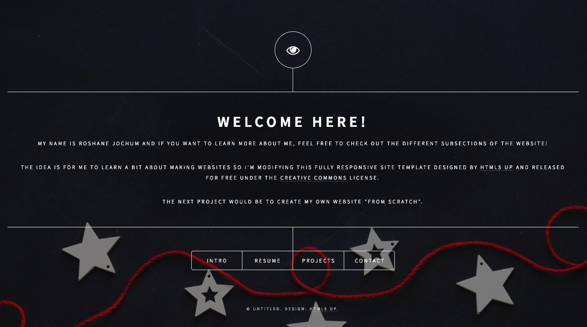

# The website

The idea here was to see how to create a nice personal website. To get familiar with webdev, I looked into the code of a template from HTML5 UP *[further credits/information at the end of the readme]*. As I was exploring the code and researching what meant what, I played with it, changing some things here and there. 

My next goal is to create my own website, this time more or less from scratch to improve my webdev skills further. 

-R

      

### HTML5UP

> Dimension by HTML5 UP
html5up.net | @ajlkn
Free for personal and commercial use under the CCA 3.0 license (html5up.net/license)

>This is Dimension, a fun little one-pager with modal-ized (is that a word?) "pages"
and a cool depth effect (click on a menu item to see what I mean). Simple, fully
responsive, and kitted out with all the usual pre-styled elements you'd expect.
Hope you dig it :)

>Demo images* courtesy of Unsplash, a radtastic collection of CC0 (public domain) images
you can use for pretty much whatever.

>AJ
aj@lkn.io | @ajlkn

Credits:

	Demo Images:
		Unsplash (unsplash.com)

	Icons:
		Font Awesome (fontawesome.io)

	Other:
		jQuery (jquery.com)
		Responsive Tools (github.com/ajlkn/responsive-tools)" 
